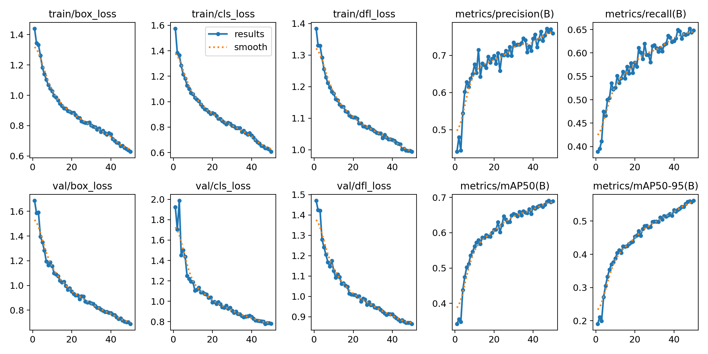
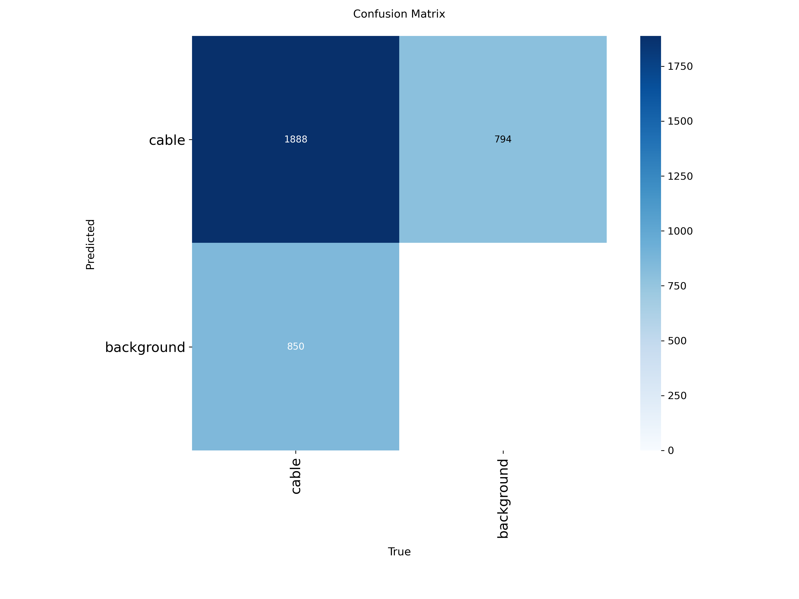
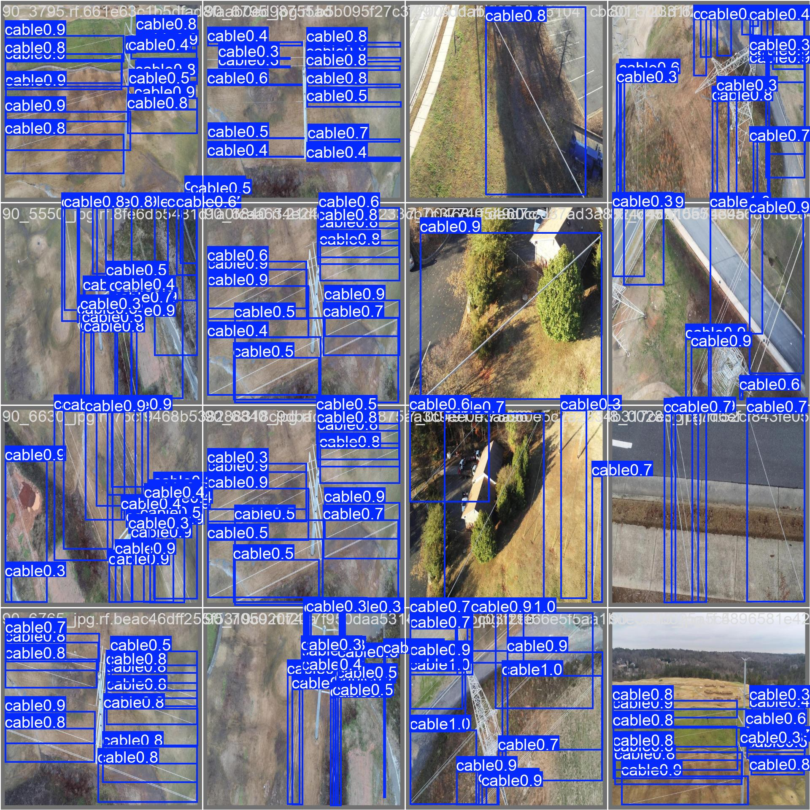

# PowerLine Vision — Automated Detection of Overhead Conductors from Aerial Imagery


## Overview

This project develops an end-to-end deep learning pipeline for the **automatic detection of overhead power lines and transmission towers from aerial imagery**. The system addresses a core challenge in electricity distribution asset management: identifying and mapping low-voltage conductors at scale, including those that are partially obscured or difficult to locate manually.

The pipeline combines YOLOv8 object detection with classical computer vision preprocessing (OpenCV) and produces confidence-scored bounding box detections suitable for downstream GIS integration and asset mapping workflows.

---

## Motivation

Electricity distribution networks span thousands of kilometres. Manual inspection and mapping of overhead conductors is time-intensive, expensive, and prone to gaps in coverage. Automated detection from aerial and UAV imagery offers a scalable alternative — enabling utilities to maintain accurate, up-to-date asset records and identify infrastructure that may be hidden by vegetation or environmental occlusion.

This project is directly motivated by real-world infrastructure intelligence challenges in the UK electricity distribution sector.

---

## Dataset

This project uses the **TTPLA Dataset** (Transmission Towers and Power Lines from Aerial imagery), a publicly available annotated dataset containing aerial images of overhead power line infrastructure.

- **Source:** [TTPLA Dataset — GitHub](https://github.com/R3ab/ttpla_dataset)
- **Classes:** Power lines, Transmission towers
- **Format:** COCO-style annotations, converted to YOLO format for training
- **Split:** 70% train / 15% validation / 15% test

To download and prepare the dataset:
```bash
python data/download_data.py
```

---

## Project Structure

```
powerline-vision/
├── README.md
├── requirements.txt
├── configs/
│   └── config.yaml              # Training and model hyperparameters
├── data/
│   ├── download_data.py         # Dataset download and preparation script
│   └── processed/               # YOLO-format annotations after conversion
├── notebooks/
│   ├── 01_data_exploration.ipynb   # Dataset statistics and visualisation
│   └── 02_results_analysis.ipynb  # Post-training evaluation and analysis
├── src/
│   ├── dataset.py               # Dataset loading, conversion, augmentation
│   ├── train.py                 # Training pipeline
│   ├── evaluate.py              # Evaluation: mAP, precision-recall, F1
│   └── utils.py                 # Shared utilities and visualisation helpers
├── scripts/
│   └── inference.py             # Run detection on new images or video
├── results/
│   └── plots/                   # Training curves, detection visualisations
└── tests/
    └── test_dataset.py          # Unit tests for data pipeline
```

---

## Model Architecture

The detection backbone is **YOLOv8n/s** (Ultralytics), fine-tuned from COCO pretrained weights on the TTPLA dataset. YOLOv8 was selected for:

- State-of-the-art real-time detection performance
- Strong transfer learning capability from diverse pretraining
- Native support for custom dataset fine-tuning
- Efficient inference suitable for edge deployment scenarios

Preprocessing uses **OpenCV** for image normalisation, contrast enhancement (CLAHE), and augmentation (horizontal/vertical flip, mosaic, HSV jitter).

---

## Results

| Metric | Value |
|---|---|
| mAP@0.5 | 0.688 |
| mAP@0.5:0.95 | 0.561 |
| Precision | 0.758 |
| Recall | 0.647 |
| Inference speed (GPU) | 4.9ms per image (Tesla T4) |
| Validation images | 359 |
| Instances evaluated | 2,738 |

*Trained for 50 epochs on YOLOv8s fine-tuned from COCO weights. Dataset: aerial power line imagery (cable detection). Hardware: Tesla T4 GPU.*

---

## Quickstart

### 1. Install dependencies
```bash
pip install -r requirements.txt
```

### 2. Download and prepare data
```bash
python data/download_data.py
```

### 3. Train
```bash
python src/train.py --config configs/config.yaml
```

### 4. Evaluate
```bash
python src/evaluate.py --weights results/best.pt --data configs/config.yaml
```

### 5. Run inference on a new image
```bash
python scripts/inference.py --source path/to/image.jpg --weights results/best.pt
```

---

## Training Results

Training curves and detection visualisations from the completed run:





Sample detections on validation images:



---

## Training Results

Training curves and detection visualisations from the completed run:


Sample detections on validation images:


---

## Limitations and Future Work

- Detection performance degrades under heavy occlusion from tree canopy — a known challenge in UK distribution networks
- LiDAR point cloud fusion is identified as a key extension to improve detection of hidden conductors; this is a planned next phase of development
- GIS export of detected conductor coordinates is in scope for a future release

---

## Author

**Karan** | MSc Data Analytics (Distinction), Aston University  
[LinkedIn](https://linkedin.com/in/karan-th) | [GitHub](https://github.com/Karanm5)

---

## Acknowledgements

- TTPLA dataset authors for making aerial power line imagery publicly available
- Ultralytics for the YOLOv8 framework
